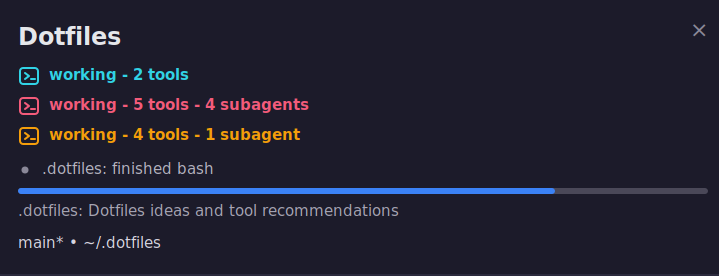

# opencode-cmux

[](https://www.npmjs.com/package/@luisurrutia/opencode-cmux)
[](LICENSE)
[](https://github.com/LuisUrrutia/opencode-cmux/actions/workflows/ci.yml)
[](https://bun.sh/)
[](https://opencode.ai/docs/plugins/)
[](https://cmux.dev/)

`@luisurrutia/opencode-cmux` is an OpenCode plugin that shows OpenCode activity in the current cmux workspace. It updates the cmux sidebar with session status, progress, tool activity, file edits, todos, questions, permission waits, notifications, and git branch state.

The plugin is quiet outside cmux. If `CMUX_WORKSPACE_ID` is missing, it returns no hooks and does nothing.

<p align="center">
  
</p>

## At a glance

| | |
| --- | --- |
| Package | `@luisurrutia/opencode-cmux` |
| Runtime | OpenCode plugin loaded by Bun |
| Target | Current cmux workspace/sidebar |
| Transport | Auto-selects cmux socket, falls back to CLI |
| Main signals | `waiting`, `question`, `working`, `error`, `done` |
| Extras | Tool activity, subagents, todos, file edits, git branch state |

## Requirements

* OpenCode with plugin support.
* cmux installed and available as `cmux`, unless `OPENCODE_CMUX_BIN` points somewhere else.
* OpenCode running inside a cmux managed terminal, so `CMUX_WORKSPACE_ID` is set.
* Bun `>=1.3.4` for local development.

## Install from npm

Add the package to your OpenCode config:

```json
{
  "$schema": "https://opencode.ai/config.json",
  "plugin": ["@luisurrutia/opencode-cmux"]
}
```

The npm package is `@luisurrutia/opencode-cmux`. Its module entry is `dist/index.js`, and the published files include `dist`, `README.md`, `LICENSE`, and `docs/assets`.

## Local development install

Build the plugin first:

```bash
bun run build
```

Then point OpenCode at the built file with an absolute `file://` URL:

```json
{
  "$schema": "https://opencode.ai/config.json",
  "plugin": ["file:///absolute/path/to/opencode-cmux/dist/index.js"]
}
```

Rebuild after changing `src/*` files.

## How it works

The core flow is:

```text
OpenCode hooks -> normalizeEvent() -> CmuxStateCoordinator -> cmux socket/CLI
```

OpenCode emits hook events. The plugin normalizes those raw events, updates a small state machine, then renders the current state to cmux.

The main sidebar status uses this priority order:

1. Permission request pending: `waiting`
2. Question pending: `question`
3. Primary session busy: `working`
4. Primary session error: `error`
5. Primary session idle: `done`

Only one main status wins at a time per OpenCode surface. Tool and subagent counts are folded into that surface's `working` status instead of rendering separate pills.

Progress is an estimate based on tool calls, elapsed time, and todos. It is throttled, never moves backward during a session, and never reaches `1.0` until the primary session goes idle. Sidebar renders are throttled, so updates are near live but not every raw event becomes a separate cmux call.

cmux status pills are keyed per OpenCode surface, so multiple OpenCode terminals in one cmux workspace can show separate `working` or `done` pills. Progress, logs, and git branch metadata are workspace-level cmux resources, so they are shared by all OpenCode terminals in that workspace. To avoid wiping another terminal's live progress, the plugin does not clear the shared progress bar during local cleanup; it only clears after rendering primary completion at `100%`.

When git integration is enabled, the plugin reports branch and dirty state during initialization and after OpenCode runs git commands through the bash tool.

## Transport behavior

`OPENCODE_CMUX_TRANSPORT` controls how the plugin talks to cmux:

* `auto`, the default, uses the socket when available and falls back to the cmux CLI when it is not.
* `socket` uses the socket when it exists. If no socket exists, it logs a warning and falls back to the CLI.
* `cli` always calls the cmux binary.

Socket discovery checks `CMUX_SOCKET_PATH`, then `CMUX_SOCKET`, then platform and user candidates such as the cmux app socket and `/tmp/cmux.sock`.

The socket path uses two protocols because cmux exposes two command shapes. Sidebar commands use the text socket protocol. Notification writes use JSON requests with `method` and `params`, such as `notification.create`.

## Configuration

All configuration uses environment variables.

Boolean values accept `1`, `true`, `yes`, and `on` for true. They accept `0`, `false`, `no`, and `off` for false. Invalid values fall back to the default.

| Variable | Default | Description |
| --- | --- | --- |
| `OPENCODE_CMUX_BIN` | `cmux` | cmux executable used by CLI transport. |
| `OPENCODE_CMUX_STATUS_KEY` | `opencode` | Base sidebar status key. Per-surface statuses and legacy cleanup keys use this as a prefix. |
| `OPENCODE_CMUX_TRANSPORT` | `auto` | `auto`, `socket`, or `cli`. |
| `OPENCODE_CMUX_NOTIFY_SUBAGENTS` | `false` | Send desktop notifications for subagent completion and errors. |
| `OPENCODE_CMUX_LOG_SUBAGENTS` | `true` | Log subagent lifecycle events in the sidebar. |
| `OPENCODE_CMUX_PROGRESS` | `true` | Show the cmux progress bar while work is active or waiting. |
| `OPENCODE_CMUX_KEEP_DONE_STATUS` | `true` | Keep the `done` status visible when the primary session goes idle. |
| `OPENCODE_CMUX_NOTIFY_QUESTIONS` | `true` | Send desktop notifications when OpenCode asks a question. |
| `OPENCODE_CMUX_NOTIFY_PERMISSIONS` | `true` | Send desktop notifications when OpenCode asks for permission. |
| `OPENCODE_CMUX_LOG_TOOLS` | `true` | Log tool start and finish events in the sidebar. |
| `OPENCODE_CMUX_LOG_TOOLS_VERBOSE` | `false` | Include tool arguments in sidebar tool logs. |
| `OPENCODE_CMUX_LOG_FILE_EDITS` | `true` | Log edited files in the sidebar. |
| `OPENCODE_CMUX_LOG_SESSION_LIFECYCLE` | `true` | Log session start, delete, and compaction events. |
| `OPENCODE_CMUX_LOG_TODOS` | `true` | Log todo completion counts. |
| `OPENCODE_CMUX_GIT` | `true` | Report git branch and dirty state to cmux. |
| `OPENCODE_CMUX_STALE_TIMEOUT` | `0` | Milliseconds before a stuck `working` state is cleared. `0` disables it. |
| `OPENCODE_CMUX_DONE_TIMEOUT` | `10000` | Milliseconds before the `done` status auto clears when `KEEP_DONE_STATUS=true`. `0` disables auto clear. |

## Troubleshooting

### Nothing shows up in cmux

Check that OpenCode is running inside cmux and that `CMUX_WORKSPACE_ID` is set. Without that variable, the plugin disables itself and returns no hooks.

### The socket is not used

Use `OPENCODE_CMUX_TRANSPORT=auto` unless you are debugging. In `auto`, the plugin silently uses the CLI when no socket is found. If you force `socket` and no socket exists, the plugin warns and falls back to the CLI.

If needed, set `CMUX_SOCKET_PATH` or `CMUX_SOCKET` to the socket path exposed by your cmux session.

### Sidebar updates affect the wrong tab

Socket mode targets the cmux workspace for sidebar metadata and uses `CMUX_SURFACE_ID` in the status key so separate OpenCode terminals do not overwrite each other's status pill. If cmux does not expose `CMUX_SURFACE_ID`, the plugin falls back to project/session/process details, but stale status cleanup is less precise.

### Status stays on working

OpenCode normally sends an idle event when a primary session ends. If that event is missed, set `OPENCODE_CMUX_STALE_TIMEOUT` to a positive number of milliseconds so the plugin can clear a stuck working state after no events arrive.

### Done disappears too quickly or never clears

`OPENCODE_CMUX_KEEP_DONE_STATUS=true` keeps `done` visible after idle. `OPENCODE_CMUX_DONE_TIMEOUT=10000` clears it after 10 seconds by default. Set `OPENCODE_CMUX_DONE_TIMEOUT=0` to keep it until the next session or cleanup.

### Too many sidebar logs

Turn off specific log groups with `OPENCODE_CMUX_LOG_TOOLS=false`, `OPENCODE_CMUX_LOG_FILE_EDITS=false`, `OPENCODE_CMUX_LOG_SUBAGENTS=false`, `OPENCODE_CMUX_LOG_SESSION_LIFECYCLE=false`, or `OPENCODE_CMUX_LOG_TODOS=false`.

## Development

Useful commands:

```bash
bun test
bun run build
bun run check
npm pack --dry-run
```

Package scripts:

* `bun run build` builds `src/index.ts` into `dist/index.js`.
* `bun test` runs the test suite.
* `bun run check` runs tests and then builds.

Before release work, run `bun test`, `bun run build`, and `npm pack --dry-run` to confirm the package contains the built entrypoint and published files.

## Attribution

This project is forked from [Attamusc/opencode-cmux](https://github.com/Attamusc/opencode-cmux). This fork keeps the same core idea and extends the package for the workflow documented above.
